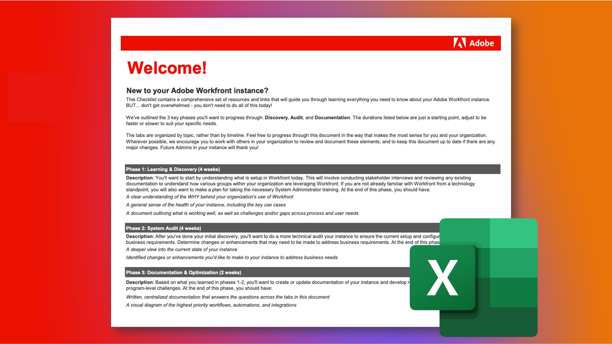

# Take Charge of an Existing Adobe Workfront Instance 

The wonderful thing about Workfront is that it’s so customizable. The challenging thing about Workfront is that it’s so customizable. And if you’re a new system, or group, administrator taking over an existing Workfront instance, it can be overwhelming to figure out how it was originally configured and set up. 

However, through our Inherited Instance Checklist, you can learn everything you need to know about your instance.  
 
 
<a href="assets/adobe-workfront-system-admin-playbook-inherited-instance.xlsx" class="spectrum-Button spectrum-Button--outline spectrum-Button--primary spectrum-Button--sizeM">
          Download the Inherited Instance checklist 
        </a>

In this checklist, you’ll review a comprehensive set of questions, resources and links to get a clear understanding of how it’s been configured. 

In addition, we've outlined 3 key phases you'll go through - Discovery, Audit, and Documentation - with suggested durations. Those can be adjusted to suit your specific needs and don’t have to be done all in one sitting!  

The tabs in the spreadsheet are organized by topic, rather than by timeline so you can progress through the document in the way that makes the most sense for you and your organization.  

Wherever possible, we encourage you to work with others in your organization to review and document these elements, and to keep this document up to date if there are any major changes. Future Admins in your instance will thank you! 

  
 
 

## Phase 1: Learning & Discovery 
<b>Suggested time frame: 4 weeks</b>

The first thing to do is to understand how your instance of Workfront is set up today.  

This involves conducting stakeholder interviews and reviewing any existing documentation to understand how various groups within your organization are leveraging Workfront.  

If you are not familiar with Workfront from a technological standpoint, take the System Administrator training. This provides the necessary insight into how different settings function and affect each tool, and potentially each user, in Workfront. 

By the end of this phase, you should have: 

* A clear understanding of the WHY behind your organization's use of Workfront 

* A general sense of the health of your instance, including the key use cases 

* A document outlining what is working well, as well as challenges and/or gaps across process and user needs 
 
 

## Phase 2: System Audit
<b>Suggested timeframe: 4 weeks </b>

After the initial discovery, it's recommended that you do a more technical audit of your instance. That means you need to determine changes or enhancements that may need to be done to ensure your current setup and configuration meets your business requirements and needs.  

By the end of this phase, you should have: 

* A deeper view into the current state of your instance  

* Identified changes or enhancements you'd like to make to your instance to address business needs.
 
 

## Phase 3: Documentation & Optimization
<b>Suggested timeframe: Initial = 2 weeks; Continual updating </b>

Based on what you learned in phases 1 and 2, you'll want to create, or update, and documentation of your instance and develop roadmaps to address strategic and program-level challenges.  

While this phase is ongoing, you should have: 

* Written centralized documentation that answers questions across the tabs in this document 

* A visual diagram of the highest priority workflows, automations, and integrations 

* A backlog or roadmap that documents future enhancements to improve organizational and strategic challenges

 
By going through each phase, and with the help of the Inherited Instance checklist, you, as a new system or group administrator, should have a better understanding of how your Workfront instance is configured, what adjustments or enhancements need to be made, and solidify your documentation to optimize your organization’s Workfront experience. 

 
 

Additional information can be found below:
* [Defining objectives for your Workfront implementation](https://experienceleague.adobe.com/docs/workfront/using/administration-and-setup/get-started-administration/define-wf-goals-objectives.html?lang=en)
* [Blog post: Executive Sponsorship and Value to Leadership](https://experienceleaguecommunities.adobe.com/t5/workfront-blogs/customer-success-tips-executive-sponsorship-and-value-to/ba-p/518353)
* [Blog Post: Introduction to Adobe Workfront KPIs ](https://experienceleaguecommunities.adobe.com/t5/workfront-blogs/kpi-dashboards-in-the-new-workfront-experience-introduction-to/ba-p/549001)
