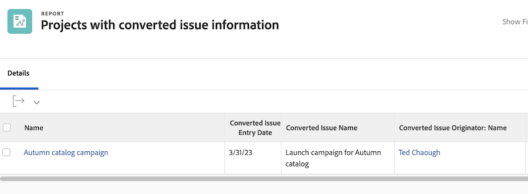

# Report on issues

## Centralize issues by creating a report

Many traffic and project managers create a [!UICONTROL Workfront] custom report to centralize all incoming issues. This makes it easy to track what's new and needs attention.

The report can then be added to a dashboard, putting everything you need to do your work in one [!UICONTROL Workfront] window.

![An image of the [!UICONTROL Resolving Object] column of an issue report.](assets/18-resolving-object-report.png)

To display the name of the task or project the issue was converted to, include the "[!UICONTROL Resolving Object]" column in the view. A "[!UICONTROL Resolving Object]" is the task or project created when you convert an issue. If an issue has not been converted the [!UICONTROL Resolving Object] field will be blank. This report quickly lets you see which issues have already been converted, so you don't end up with duplicates. Just click the resolving object name to open it so you can track progress on the work being done.

## Show original issue information in reports

When an issue is converted into a project or task many of the original issue details can be reported on in project or task reports. The original issue is refferred to as the "[!UICONTROL Converted Issue]". 

A project or task report can display this information using the [!UICONTROL Converted Issue Originator] object along with two dedicated fields. These columns can be added to a custom view without the need for text mode:

* [!UICONTROL Converted Issue Entry Date]
* [!UICONTROL Converted Issue Name]
* [!UICONTROL Converted Issue Originator > Name]

>[!NOTE]
>
>For instructions on how to create a view see [Create a basic view](https://experienceleague.adobe.com/docs/workfront-learn/tutorials-workfront/reporting/basic-reporting/create-a-basic-view.html?lang=en).

