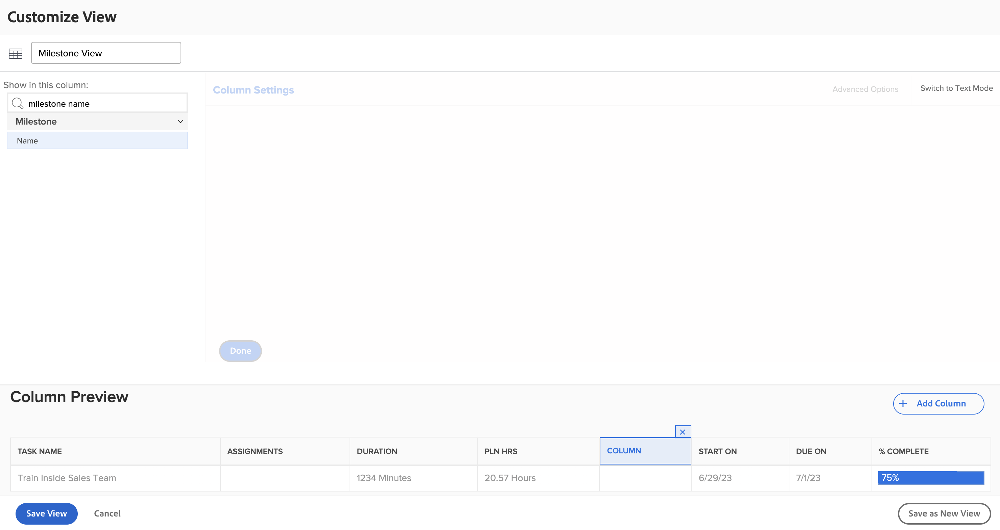
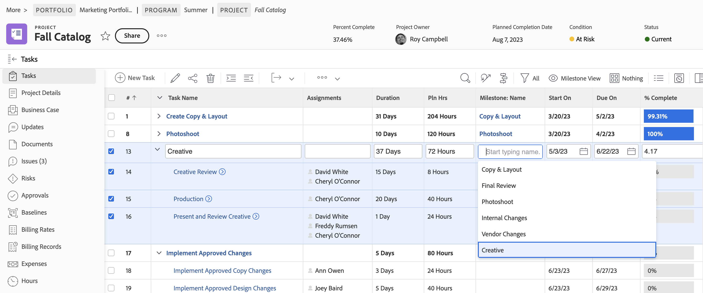

# Create a basic view

In this video, you will learn:

* What a view is in Workfront
* How to create and modify a view
* How to share a view with other Workfront users

>[!VIDEO](https://video.tv.adobe.com/v/335148/?quality=12&learn=on)

## Activity 1: Create a task status view

As a project manager, team lead, or resource manager, you want to keep track of how task work is progressing. With this view, you get several status indicators of a task all in one row of the list or report.

Create a task view named "Task Status View" with the following columns:

* [!UICONTROL Task Name]
* [!UICONTROL Assignments]
* [!UICONTROL Duration]
* [!UICONTROL Percent Complete]
* [!UICONTROL Status]
* [!UICONTROL Progress Status]
* [!UICONTROL Status Icons]

## Activity 1 Answer

1. In a task list report, go to the **[!UICONTROL View]** drop-down menu and select **[!UICONTROL New View]**.
1. Name your view "Task Status View."
1. Remove these columns: [!UICONTROL Pln Hrs], [!UICONTROL Predecessors], [!UICONTROL Start On], and [!UICONTROL Due On].
1. Click **[!UICONTROL Add Column]**.
1. In the [!UICONTROL Show in this column] field, type "status" then select "Status" under the [!UICONTROL Task] field source.
1. Click **[!UICONTROL Add Column]** again.
1. In the [!UICONTROL Show in this column] field, type "status" then select "Progress Status" under the [!UICONTROL Task] field source.
1. Click **[!UICONTROL Add Column]** again.
1. In the [!UICONTROL Show in this column] field, type "status" then select "Status Icons" under the Task field source.
1. Click **[!UICONTROL Save]**.

Hover over each of the icons in the [!UICONTROL Status Icons] column to see what they represent. If they are grayed out, it means the task has no notes, documents, approval processes, etc. If an icon appears in color, there is at least one of that item associated with the task. You can click on the note or document icons to go to that item.

## Activity 2: Create a milestone view

If you use milestones, this view is the easiest way to see milestones by name and add or edit them using in-line edit.

Create a task view named "Milestone View" with the following columns:

* [!UICONTROL Task Name]
* [!UICONTROL Assignments]
* [!UICONTROL Duration]
* [!UICONTROL Pln Hrs]
* [!UICONTROL Milestone: Name]
* [!UICONTROL Start On]
* [!UICONTROL Due On]
* [!UICONTROL Percent Complete]

## Activity 2 Answer

1. In a project task list, go to the **[!UICONTROL View]** drop-down menu and select **[!UICONTROL New View]**.
1. Name your view "Milestone View."
1. Click on the [!UICONTROL Predecessors] column to select it.
1. In the [!UICONTROL Show in this column] field, click on the X icon in the [!UICONTROL Task >> Predecessors] field, then type "[!UICONTROL milestone name]" and click on "[!UICONTROL Name]" in the list.
1. Click **[!UICONTROL Save]**.

