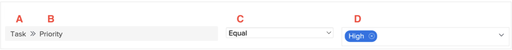

# Understand reporting components

In this video, you will learn:

* The key components behind Workfront reporting
* How these components are used in a reporting element

>[!VIDEO](https://video.tv.adobe.com/v/335146/?quality=12&learn=on)

## Reporting components

   

**A - Field source**

Field source options are dependant on the object type selected. Often, the field source is the item in Workfront that a specific piece of information (aka the field name) belongs to. Sometimes the field source is the same as the object type.
The field source determines what fields names are available.

Examples: [!UICONTROL Project], [!UICONTROL Task], [!UICONTROL Issue], [!UICONTROL Assigned To]

**B - Field name**

Field names are pieces of information available on what you selected as the field source.

They can be Workfront fields you filled in, fields from a custom form, or informations that Workfront automatically captures.

Field names drive the value field options.

Examples: [!UICONTROL Progress Status], [!UICONTROL Description], [!UICONTROL Planned Completion Date], Custom form fields

**C - Filter qualifiers**

Filter qualifiers help narrow down the possible results viewable under the field source and field name selected.

They specify how the field source and field name relate to the value field.

Examples: Equal, Contains, Null, Less than

**D - Value**

The value is the piece of information that's entered in the field specified by the field name.

Options for value are determined by the field source and field name.

Wildcards for users and dates can be used in the value, as well as free form text.

Examples: New, Current, $$TODAYbw, Description

>[!TIP]
>
>For help understanding specific field names in Workfront, look in the [Glossary of Adobe Workfront terminology](https://experienceleague.adobe.com/docs/workfront/using/basics/workfront-terminology-glossary.html?lang=en).

