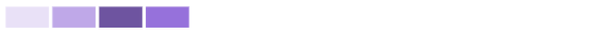
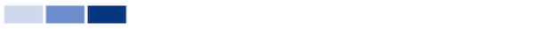

# Understand actions in [!UICONTROL Enhanced Analytics] - hover, click and drag, and click in

In this video, you will learn:

* How to get more information by hovering over a chart
* Create a timeframe on a chart
* How to make additional charts appear

>[!VIDEO](https://video.tv.adobe.com/v/335044/?quality=12&learn=on)

## Click a chart for more information

Clicking into certain portions of a chart reveals additional charts or a breakdown of the chart's information.

* **Flight plan**—Click on the project name to see the Burndown and Tasks in flight charts.
* **Project activity**—Click on the project name to expand the chart and see the project activity by user.
* **Project treemap**—Click on a project box to pull up the Burndown and Tasks in flight charts.
* **Activity by team**—Click the team name to expand the chart so you can see activity by user.
* **Resource capacity**—Click the team name to see the Team capacity chart.

## What does a darker and lighter shade mean when it comes to team activity?

**Users logged in:** Purple boxes show that people on the home team logged in on that day. A darker shade indicates a higher number of people logging in.

**Task status change:** Pink boxes show that people on the home team changed the status of a task on that day. A darker shade indicates a higher number of task statuses changing.

**Tasks completed:** Blue boxes show that people on the home team completed a task on that day. A darker shade indicates a higher number of tasks being completed.

For more information see [Understand the Activity by team visualization](https://experienceleague.adobe.com/docs/workfront/using/reporting/enhanced-analytics/activity-by-team-overview.html?lang=en).
