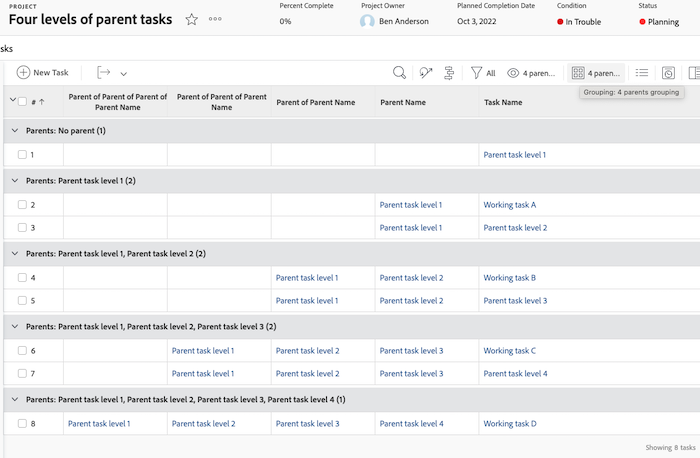
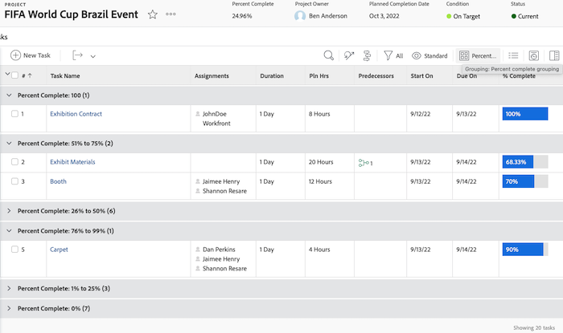
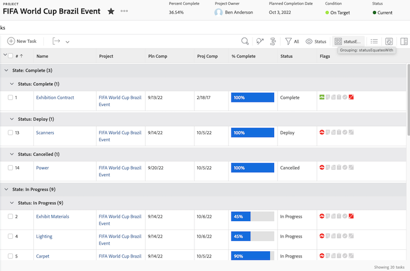
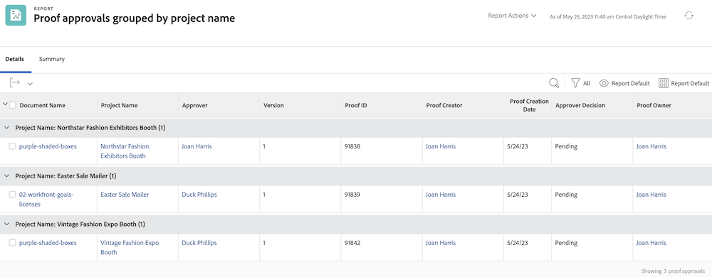

# Understand basic text mode for groupings

>[!IMPORTANT]
>
>Prerequisites:
>
>* Understand reporting elements
>* Understand reporting components
>* Create a basic grouping

>[!TIP]
>
>* To gain a more in depth understanding of text mode we recommend watching the recorded webinar event [Ask the Expert - Introduction to Text Mode Reporting](https://experienceleague.adobe.com/docs/workfront-events/events/reporting-and-dashboards/introduction-to-text-mode-reporting.html?lang=en), which is one hour in length.
>* To learn even more about text mode we recommend watching the [Advanced reporting](https://experienceleague.adobe.com/docs/workfront-learn/tutorials-workfront/reporting/advanced-reporting/welcome-to-advanced-reporting.html?lang=en) tutorials, which together are five and a half hours in length.

In this video, you will learn:

* What text mode is 
* What camel case is 
* Some basic “plug and play” text mode you can use in your groupings 

>[!VIDEO](https://video.tv.adobe.com/v/3410641/?quality=12)

## Task - 4 parents grouping

The following text mode will group tasks based on up to four levels of parents, and leave parents that don't exist blank.

```
textmode=true
group.0.name=Parents
group.0.valueexpression=CONCAT({parent}.{parent}.{parent}.{parent}.{name},IF(ISBLANK({parent}.{parent}.{parent}.{parent}.{name}),"",", "),{parent}.{parent}.{parent}.{name},IF(ISBLANK({parent}.{parent}.{parent}.{name}),"",", "),{parent}.{parent}.{name},IF(ISBLANK({parent}.{parent}.{name}),"",", "),IF(ISBLANK({parent}.{name}),"No parent",{parent}.{name}))
group.0.linkedname=parent
group.0.namekeyargkey.0=parent
group.0.namekeyargkey.1=name
group.0.valueformat=string
```




## Task - Percent complete grouping

The following text mode will group tasks based on their percent complete. Tasks will fall into one of the following categories when grouped:

* 0%
* 1% to 25%
* 26% to 50%
* 51% to 75%
* 76% to 99%
* 100%

```
group.0.linkedname=direct
group.0.namekey=percentComplete
group.0.valueexpression=IF({percentComplete}<1,"0%",IF({percentComplete}<26,"1% to 25%",IF({percentComplete}<51,"26% to 50%",IF({percentComplete}<76,"51% to 75%",IF({percentComplete}<100,"76% to 99%",IF({percentComplete}=100,"100","***"))))))
group.0.valueformat=doubleAsString
textmode=true
```



## Task - statusEquatesWith, then status

The following text mode will group tasks by statusEquatesWith, then by status.

```
group.0.enumclass=com.attask.common.constants.TaskStatusEnum
group.0.enumtype=TASK
group.0.linkedname=direct
group.0.name=State
group.0.type=enum
group.0.valuefield=statusEquatesWith
group.0.valueformat=val
group.1.enumclass=com.attask.common.constants.TaskStatusEnum
group.1.enumtype=TASK
group.1.linkedname=direct
group.1.namekey=status
group.1.type=enum
group.1.valuefield=status
group.1.valueformat=val
textmode=true
```




## Proof Approval - Group by project name

```
group.0.valueformat=HTML
group.0.valuefield=documentVersion:document:project:name
group.0.displayname=Project Name
```



