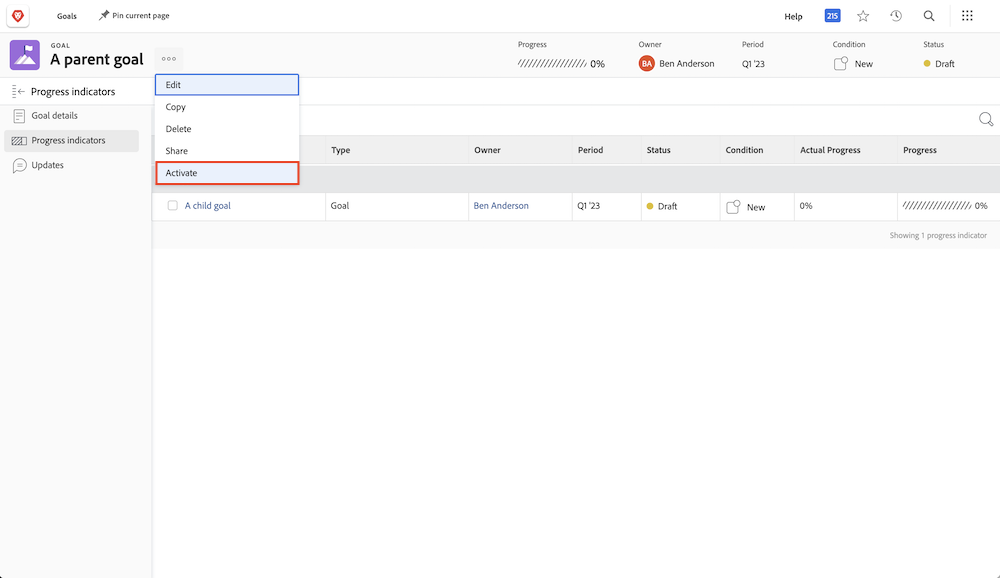

# Activate by aligning a goal to another in [!DNL Workfront Goals]

When you align two goals one will become the parent goal and the other a child goal. A parent goal can have multiple child goals but a child goal can only align to one parent goal.

1. Open the child goal by clicking on it's name in the [!UICONTROL Goal List]. By default you will find yourself in the [!UICONTROL Goal Details] tab.
1. Click the [!UICONTROL +Add] button in the [!UICONTROL Parent goal information] panel.

    ![A screenshot of the [!UICONTROL Goal Details] tab](assets/06-workfront-goals-align-goals.png)

1. Start typing the name of the desired parent goal in the [!UICONTROL Parent goal] field, then select it when it appears in the list. Only goals from the same period or a future period appear in the list.

    ![A screenshot of the [!UICONTROL Goal Details] panel showing the [!UICONTROL Parent goal information] panel](assets/07-workfront-goals-align-to.png)

1. Click [!UICONTROL Save Changes].

Aligning a goal to another goal creates a child goal. Think of child goals as individual goals that contribute to the progress of the organization's or team's parent goals. Child goals can activate and influence the progress of the parent goal.

## Now activate the parent goal

Now that you have created a child goal it becomes a progress indicator on your parent goal. You will see the Activate option when you click on the three dot menu next to the parent goal name.

